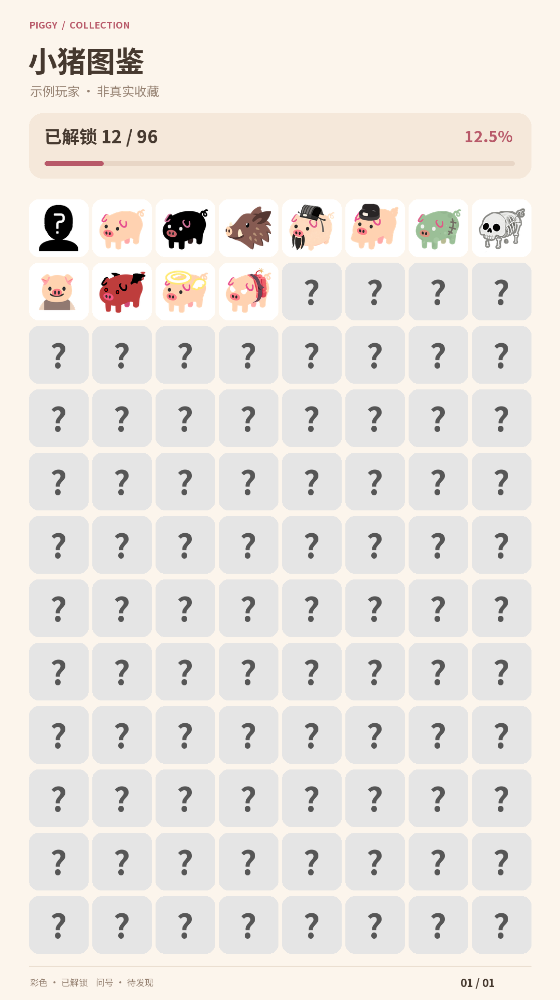
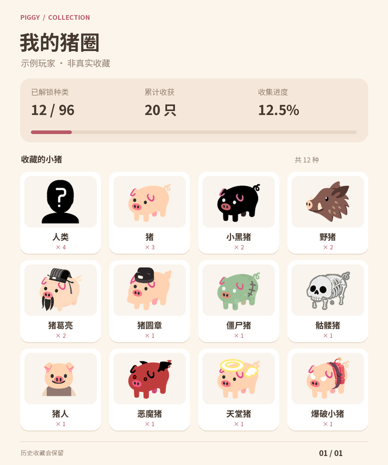

<div align="center">


# 🐷 小猪收集册

**每天领一只小猪，把日子攒成一座猪圈。**

✨ [AstrBot](https://github.com/AstrBotDevs/AstrBot) · QQ 官方机器人 · 每日抽猪与跨群收藏 ✨

[](LICENSE)
[](https://www.python.org/)
[](https://github.com/AstrBotDevs/AstrBot)
[](https://github.com/yun474)


[功能亮点](#features) · [效果预览](#preview) · [安装使用](#usage) · [R2 配置](#r2) · [猪库维护](#catalog) · [数据备份](#backup)

</div>

---

<a id="features"></a>

## ✨ 今天，你会抽到哪只猪？

每天一次，跨群共享。从普通小猪到奇奇怪怪的猪猪，慢慢解锁整本图鉴；抽到老朋友也不亏，猪圈会记住每一次相遇。

| | 玩法 |
| --- | --- |
| 🎲 **今日小猪** | 大图展示、固定描述、累计次数，第一次相遇还有解锁提示 |
| 📖 **小猪图鉴** | 全猪库一览，已解锁彩色、未解锁灰色，收集进度一眼可见 |
| 🏡 **我的猪圈** | 奶油风收藏卡片，展示所有已拥有的小猪、名字与数量 |
| 🏆 **小猪排行** | 解锁种类与累计数量双榜，看看群里谁才是养猪大户 |
| 🧩 **方便维护** | 内置 96 种小猪，支持增删改；R2 / S3 / HTTP 图床接入 |
| 💾 **认真记账** | SQLite 事务保存、定期本地备份，图片失败可重试，收藏不重复增加 |

> 🛠️ **开发预览**：当前版本 `0.0.0` 为开发占位，尚未正式发布。功能与本地渲染已实现，真实 R2 上传及 QQ 发送仍待部署联调。

<a id="preview"></a>

## 🍮 奶油风效果预览

下面使用示例收藏数据，图片由插件实际渲染。图鉴不额外显示猪名；猪圈保留名字与次数。灰色图片自动生成，无需另外准备素材。

<table>
  <tr>
    <th>📖 小猪图鉴 · 全部 96 种</th>
    <th>🏡 我的猪圈 · 已解锁收藏</th>
  </tr>
  <tr>
    <td valign="top"></td>
    <td valign="top"></td>
  </tr>
</table>

<a id="usage"></a>

## 🚀 安装与使用

在 AstrBot 插件管理中通过仓库链接 `https://github.com/yun474/astrbot_plugin_piggy` 安装，也可使用 ZIP 安装功能导入开发包。与旧版“今日小猪”同时启用会发生命令冲突，测试时请先停用旧插件。

配置图床后，在 QQ 群里 @机器人使用以下指令。默认快捷按钮使用 `/` 前缀，请与 AstrBot 的唤醒前缀保持一致。

| 指令 | 功能 |
| --- | --- |
| 今日小猪 / 抽小猪 | 当天首次抽取，之后返回同一只；大图、固定描述、累计次数、首次解锁提示 |
| 小猪图鉴 [页码] | 全部有效猪库总览，已解锁彩色、未解锁灰色，不附猪名；显示玩家解锁进度 |
| 我的猪圈 [页码] | 已拥有的小猪、每种数量、收集进度；保留下架收藏 |
| 小猪排行 [种类/数量] | 本群参与玩家的跨群累计排行，每类仅显示前十位玩家，不分页 |
| 小猪称呼 名字 | 设置自己的展示称呼，1–24 字，不影响账号身份 |
| 小猪重载 | AstrBot 管理员：校验并应用猪库变化 |
| 小猪备份 | AstrBot 管理员：创建完整本地备份 |
| 小猪诊断 | AstrBot 管理员：强制上传一张小猪图（绕过 URL 缓存），发送并检查 QQ 图片转存 |

四个主入口附带真实 QQ keyboard 指令按钮；分页和排行榜切换同样使用按钮。根据 QQ 官方字段说明，群聊指令按钮会把指令填入输入框，用户发送后执行。此包不接入点击即执行的回调按钮，不修改 AstrBot 全局事件订阅。

### 🎲 抽猪消息示例

开头艾特抽取者，状态直接显示“首次解锁！”等提示，不使用固定称呼。猪名单独加粗、位于图片上方；只有短描述和性格描述放在一级引用块中。

```markdown
<@!openid>

### 🐷 今日小猪

首次解锁！

**猪**


> 标准猪，别无分店
>
> 你是猪圈里的出厂默认款，粉嫩、四脚齐全、尾巴打个卷……

本猪累计 **1** 次 · 总收获 **20** 只

已解锁 **12/96** · 2026-09-14
```

消息下方固定两行入口：“今日小猪 / 小猪图鉴”、“小猪排行 / 我的猪圈”。排行榜再附“种类榜 / 数量榜”切换按钮；仅图鉴与猪圈在需要时提供翻页。

## 🐾 收藏规则

- 同一 AppID 下按官方用户标识关联账号，跨群共享；东八区自然日每天一次。
- 一次 SQLite 事务写入抽取记录和收藏数量，唯一约束防止跨群并发、重复事件及按钮连点刷次数。
- 先保存抽取结果，再上传和发消息。上传失败不会重新抽奖，之后重新发指令仍返回当天结果。
- 完全未配置图床时，首次抽取会提示配置问题，不消耗当日抽取。
- 种类榜统计历史不同猪种，数量榜统计累计抽取次数，包含下架收藏；同分同名次，同分按玩家内部 ID 排序，每榜最多展示十位玩家。
- 每日一抽下，数量榜相当于累计成功签到天数榜。
- “本群玩家”指在本群使用过插件的玩家；不依赖白名单群成员接口，不声称实时反映退群状态。
- 进度条的分子/分母仅统计当前有效猪库，下架收藏单列。因此下架后进度与历史排行的口径不同。
- 此版面向 QQ 官方群聊；C2C、频道及不同 AppID 不自动合并身份。

<a id="r2"></a>

## ☁️ R2 配置

1. 创建 R2 桶，并生成该桶的对象读写凭据。
2. 在桶的 **Settings → Custom Domains** 中绑定如 `img.example.com` 的域名，等待状态变为 Active。
3. 在 AstrBot 插件配置中填写：

| 配置项 | R2 填写示例 |
| --- | --- |
| provider | `s3` |
| endpoint | `https://<ACCOUNT_ID>.r2.cloudflarestorage.com` |
| bucket | `pig-images` |
| access_key | R2 Access Key ID |
| secret_key | R2 Secret Access Key |
| region | `auto` |
| addressing_style | `path` |
| public_base_url | `https://img.example.com` |
| key_prefix | `piggy` |

**上传接口与图片公网域名是两个不同地址。** `endpoint` 用于签名上传；`public_base_url` 用于拼出 QQ 可直接下载的图片直链。不要把 R2 的 API 地址填进图片 Markdown。

正式使用推荐绑定自有域名。Cloudflare 把 `r2.dev` 定位为有频率限制的开发地址；不要用 CNAME 绕接 `r2.dev`。图片地址不能要求 Cookie、登录、自定义请求头或人机验证。参见 [R2 公共桶](https://developers.cloudflare.com/r2/buckets/public-buckets/) 和 [官方 boto3 示例](https://developers.cloudflare.com/r2/examples/aws/boto3/)。

上传使用 S3 PutObject，不发送 R2 不支持的 ACL 参数。对象名采用图片内容 SHA-256，重复访问复用缓存，内容变化会生成新地址；数据库、用户 ID 和备份不会上传到 R2。图床凭据由 AstrBot 配置管理，请不要把含密钥的配置文件放进 Git 仓库。

## 🖼️ 其他图床

插件按上传协议适配，不为每家网站装一个 SDK。目前支持：

| 协议 | 范围 |
| --- | --- |
| S3 兼容 | R2、AWS S3，以及提供兼容 PutObject 的对象存储；配置对应 endpoint、region、地址模式和公网域名 |
| HTTP multipart | Lsky、Chevereto 等提供文件上传 API 的图床 |
| HTTP JSON + Base64 | 接收 Base64 图片字段并返回 JSON 直链的上传服务 |

HTTP 模式可配置上传地址、请求头、附加字段、文件字段、成功状态及直链 JSON 路径。支持对象字段与数组下标，例如 `data.links.url`、`image.url`、`data.0.url`；不执行 JSONPath 脚本或表达式。

Lsky v2 风格示例（具体版本以部署站点 API 为准）：

```json
{
  "provider": "http",
  "upload_url": "https://your-host.example/api/v1/upload",
  "upload_mode": "multipart",
  "upload_headers": "{\"Authorization\":\"Bearer YOUR_TOKEN\",\"Accept\":\"application/json\"}",
  "upload_fields": "{}",
  "file_field": "file",
  "success_path": "status",
  "success_value": "true",
  "response_url_path": "data.links.url"
}
```

Chevereto API v1 风格：上传路径通常为 `/api/1/upload`，`file_field=source`，附加字段可填 `{"key":"YOUR_API_KEY","format":"json"}`，成功字段 `status_code` 对应 JSON 值 `200`，直链路径 `image.url`。认证方式以你部署版本为准。参见 [Chevereto API 文档](https://v3-docs.chevereto.com/api/) 与 [Lsky 官方项目说明](https://github.com/lsky-org/lsky-pro/discussions/357)。

在 WebUI 的“JSON”文本框里直接填 JSON 对象/值，不需要手动把它再次转义。上面例子中的转义只是完整配置文件的字符串表示。multipart 的 Content-Type 由客户端自动生成，请勿自行填写 boundary。

HTTP JSON 模式把 `file_field` 指定的字段设置为原始图片的 Base64 字符串，附加字段保留 JSON 类型。它不自动添加 `data:image/...;base64,` 前缀。

需要 OAuth 多步登录、私有签名算法、分段上传、非 JSON 响应等协议的服务，仍需新增适配器。实现 `core/storage.py` 的 `ImageHost.upload/close` 接口即可扩展；不声称任意图床零配置可用。插件不会自动跨图床切换，也不会创建图床账户或存储桶。

## 🔄 图片校验与重试

所有 Markdown 消息包含：

```json
{
  "msg_type": 2,
  "markdown": {
    "content": "",
    "force_verify_image_resource": true
  }
}
```

该字段位于 **markdown 内部**。它要求 QQ 校验图片转存，转存失败时返回错误且不发送这条 Markdown；它不是用户客户端图片加载完成的回执。[QQ 发送群聊消息文档](https://bot.q.qq.com/wiki/develop/api-v2/autogen/api/v2_groups_group_openid_messages.post.html)

| 配置项 | 默认值 | 含义 |
| --- | --- | --- |
| upload_retry_count | 2 | 每次上传失败后的额外重试次数，0 表示只试一次，范围 0–10 |
| image_retry_count | 3 | QQ 图片转存/临时发送失败后的额外重试次数，0 表示只试一次，范围 0–10 |
| retry_base_delay | 1 秒 | 指数退避基础间隔，单次等待最多 15 秒 |
| request_timeout | 20 秒 | 单次网络请求超时 |
| cache_ttl_hours | 168 小时 | 图床 URL 缓存有效期；应小于供应商签名 URL 的有效期 |

- 上传遇到网络错误、429、临时服务端错误才重试。认证错误、业务失败、响应结构错误直接提示。
- QQ 返回明确的图片转存错误 `304010` / `40034004` 时，等待后强制重新上传相关图片一次，随后继续按预算重试转存。
- 对象存储同内容覆写同一个键；HTTP 图床重传可能产生额外副本，数量受重试预算限制。
- 正常 Markdown 不同时塞入普通 `content`、`ark` 或 `media.file_info`。
- QQ 明确拒绝发送后，持久化下一个消息序号；网络超时或服务端结果不明时，保留同一序号重试。重复投递、插件重启也读取这份记录。
- 收到同序号去重响应视为此前已被 QQ 接受；结果始终不明时只记录日志，不再额外发送一张新卡片。
- 内容违规、权限、参数错误和回复过期不反复重试，不自动改成主动消息发送。
- 回复处理有约 240 秒的预算，排队、上传或重试超出预算时结束。正在进行的单次网络请求仍受自身超时限制。
- 配置的次数分别作用于上传和 QQ 发送；一个分页含多张图片时，每张上传各有预算。失败后的纯文本提示不属于图片发送重试。
- 图片本地内容与抽取账本保留，之后重新发指令可以继续展示，不增加收藏次数。

发送模块复用 AstrBot 的 QQ 客户端令牌生命周期，以独立 HTTP 请求保留结构化错误码，避免 `qq-botpy 1.2.1` 仅抛出错误文案造成误判。不会记录 Authorization、图床请求头或签名 URL。

## 🩺 Docker 上传故障排查

更新插件后重新加载插件，再以管理员身份执行“小猪诊断”。诊断会强制上传图片，不会因旧 URL 缓存而跳过对象存储检查，也不消耗每日抽取。

此前“对象存储请求配置无效”的提示无法区分 SDK、TLS 与代理故障，不能据此认定凭据有误。新版后台日志包含 `command`、实际尝试次数/最大次数、是否可重试、`stage`（`create_client` 或 `put_object`）、异常类型、boto3/botocore 版本及脱敏原因。S3 服务返回错误时另记 HTTP 状态、服务错误码和 Request ID；群内只发送简短原因及检查方向。

| 日志中的类型或错误码 | 含义与检查方向 |
| --- | --- |
| `SSLError` + `CERTIFICATE_VERIFY_FAILED` | 容器 TLS 证书校验失败；检查容器 CA 证书、系统时间、`AWS_CA_BUNDLE` 与 HTTPS 代理证书链，不要关闭 TLS 校验 |
| `SSLError` + `EOF` / 握手中断 | TLS 连接被中断；按配置重试，检查容器网络与代理 |
| `ProxyConnectionError` | 连接进程环境指定的代理失败；检查容器内 `HTTP_PROXY` / `HTTPS_PROXY`，容器中的 `127.0.0.1` 指向容器本身 |
| `EndpointConnectionError` / 超时 | 检查容器 DNS、S3 API 地址可达性和网络超时；日志保留底层原因 |
| `ParamValidationError` | SDK 参数校验未通过，按日志指出的具体字段修正 |
| `TypeError` + `create_client` | 常见于 SDK 参数或依赖不兼容，先核对日志中的 SDK 版本和 `requirements.txt`，不能直接判断为凭据错误 |
| `AccessDenied` / `InvalidAccessKeyId` | 对象写入权限不足，或 S3 凭据与账户接口不匹配 |
| `SignatureDoesNotMatch` | 核对 Secret Access Key、区域、接口与系统时间 |
| `NoSuchBucket` | 桶名或账户接口不匹配 |

日志不输出完整配置、凭据、代理密码或签名 URL 的查询参数；请提供新版 `[piggy] Upload failed` 行进行定位，不要发送密钥。配置里的 S3 地址、桶名、凭据和区域会自动去除首尾空白；桶名不能填 URL，API 地址不能填临时签名链接。

本地回归覆盖异常分类、日志脱敏和 S3 的真实 HTTP 请求/错误响应解析；这不替代部署容器到 R2 的 TLS、DNS 与权限联调。异常分类依据 [Boto3 错误处理文档](https://docs.aws.amazon.com/boto3/latest/guide/error-handling.html)，R2 配置可参照 [Cloudflare 官方 boto3 示例](https://developers.cloudflare.com/r2/examples/aws/boto3/)。

<a id="catalog"></a>

## 🧩 猪库维护

首次启动复制内置 96 种小猪到持久化目录。默认位置：

```text
data/plugin_data/astrbot_plugin_piggy/
  piggy.sqlite3        # 抽取账本、收藏、昵称、发送回执与 URL 缓存
  catalog/
    pigs.json          # 管理员编辑的猪库
    images/            # 对应素材
  assets/              # 内容寻址的历史原图，请保留
  thumbnails/          # 可重建的彩色/灰度缩略图
  cards/               # 可重建的奶油风合成图，未使用满 7 天后清理
  backups/             # 本地一致性备份 ZIP
```

编辑 `catalog/pigs.json`，执行“小猪重载”：

```json
{
  "id": "pig",
  "name": "小猪",
  "description": "标准猪，别无分店",
  "analysis": "对应的固定性格描述",
  "image": "images/pig.png",
  "enabled": true,
  "sort_order": 0
}
```

- 新增：添加条目和本地图片。有效总数自动计算；默认等概率。
- 修改：保持 ID 不变，更新名称、文案或图片。历史当天抽取保存原始快照，累计收藏仍属于同一个 ID。
- 删除：设置 `enabled=false` 或从列表移除，即下架。旧收藏及历史素材保留；重新启用同一个 ID 会恢复该收藏。
- **不要把旧 ID 分配给另一种猪**，否则会与原收藏合并。
- ID 仅允许小写字母、数字、下划线和短横线；重载检查重复 ID、文字长度、缺图、图片解码、路径越界及空抽取池。PNG/JPEG/WebP 每张不超过 10 MB、1600 万像素。
- 不合法猪库不会覆盖数据库中的上一份有效猪库。已有数据库时，配置文件丢失也不会悄悄重建成默认猪库。
- 插件代码升级不会覆盖持久化目录；图片放在插件代码目录中再修改，不会影响运行猪库。

<a id="backup"></a>

## 💾 数据与备份

SQLite 使用 WAL、外键、FULL 同步和忙等待，本地事务保留每日完整账本。放在持久化本地磁盘上，Docker 请挂载 AstrBot 数据卷；不使用网络共享盘承载运行中的 SQLite。

启动和每 24 小时自动备份，管理员也可手动备份，保留数量由 `backup_keep` 控制。备份通过 SQLite backup API 创建一致性快照，再导出同一快照中的已生效猪库、当前图片及历史原图，最后原子发布 ZIP。未重载的 JSON 草稿不作为备份中的有效猪库。备份错误保留原数据库，不自动清空数据。

恢复步骤：停用插件 → 保留原数据目录作为回退 → 将一个可信备份解压到**新的空目录** → 把它作为插件数据目录 → 启用插件。不要向正在运行的数据库覆盖文件，也不要把旧目录里的 `-wal`、`-shm` 文件混入恢复目录。备份没有图床凭据，需要保留 AstrBot 配置。恢复已在临时目录中测试；整机丢盘仍需运维另存一份备份。

## 🔧 兼容性与验证范围

- Python 3.10+；技术下限声明为 **AstrBot >=3.5.3**，依据该版本首次包含本插件使用的 `StarTools.get_data_dir`，v3.5.2 尚无此方法。未因为检查了较新版本就抬高最低版本。
- 对照检查了 AstrBot v3.5.3 与上游 `4007d645c9a2983da2207ba09280b930680a0fde`（4.28.0 源码）的相关接口；依赖官方群聊事件的 `bot.api._http` 令牌/请求头接口。
- QQ Webhook 事件继承同一官方消息事件类，按相同发送链路处理；WebSocket/Webhook 的真实账号联调仍待部署环境验证。
- 新版消息事件可提供昵称；老适配器可能遗漏昵称，使用已保存称呼或玩家短编号，可用“小猪称呼”设置。不会凭同名合并账号。
- 本地测试使用 Python 3.12.13、qq-botpy 1.2.1、boto3 1.43.93、aiohttp 3.14.3、Pillow 12.3.0。业务、协议与入口使用临时数据库/模拟官方事件/本地 HTTP 服务/SDK Stubber 验证，不等同于整套 AstrBot 实机联调。
- 尚未使用真实 R2 凭据、真实 QQ AppID 发消息。上线前执行“小猪诊断”，再让同一账号跨两个群验证身份一致和每日唯一；确认客户端按钮表现。

开发检查（在本目录执行）：

```shell
python -m pip install -r requirements.txt qq-botpy==1.2.1 ruff
python -m unittest discover -s tests -v
ruff check .
ruff format --check .
```

## 🎨 卡片渲染说明

“我的猪圈”只展示玩家已解锁的猪猪，小图位于名字上方，显示累计次数、总收获和收集进度；下架收藏仍然保留。当前 96 种均能放入一张猪圈图，不会只展示当天抽到的猪猪。

“小猪图鉴”展示整个有效猪库，当前 96 种放在同一张总览中。每格只显示图片，已解锁彩色、未解锁自动转灰；不再增加猪名、次数或单格文字标签。顶部显示玩家称呼、解锁数量/总数和百分比。原素材自身带有的文字不作涂改。

灰图由原图在本地生成，保留透明通道，不需要另外提供灰色素材。渲染使用随包字体，不依赖系统中文字体或浏览器服务。每个页面先合成本地 PNG，再上传图床，最终发送一张经过 QQ 转存校验的 Markdown 图片，按钮仍是真实 keyboard。

为避免后续扩充成超大图片，猪圈每张最多 96 种，图鉴每张最多 192 种；超出时提供分页按钮，所有条目均可访问。排行榜固定展示每类前十位玩家，不显示页码或翻页按钮。页面按内容缓存，收藏、昵称或素材变化会生成新图；本地合成图超过七天未使用会被清理，原始素材与记录不受影响。

## 💛 致谢与许可证

初始猪库与图片来自 [MegSopern/astrbot_plugin_rollpig](https://github.com/MegSopern/astrbot_plugin_rollpig/tree/42490b1b88367260c137c1147b05a3c052f22d33)，保留上游 Bear_lele、MegSopern 的 MIT 声明及致谢。新代码作者为 yun474。字体使用 [Noto Sans SC](https://github.com/google/fonts/tree/main/ofl/notosanssc)，完整 SIL Open Font License 见 `resources/fonts/OFL.txt`；字体不按项目 MIT 许可证重新授权。

感谢原作者们留下这群可爱的小猪，也欢迎去上游仓库点一颗 ⭐。

### 📦 发布状态

项目仓库：[yun474/astrbot_plugin_piggy](https://github.com/yun474/astrbot_plugin_piggy)。当前为开发预览，尚无正式 Release；正式版本号与 CHANGELOG.md 由维护者确认。
