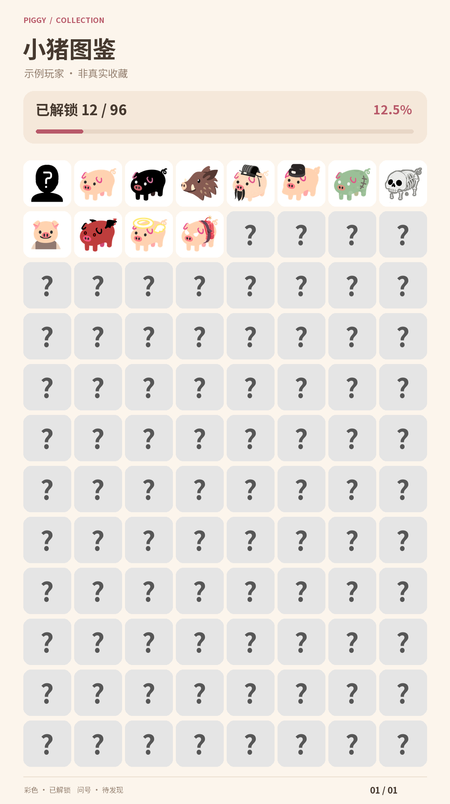
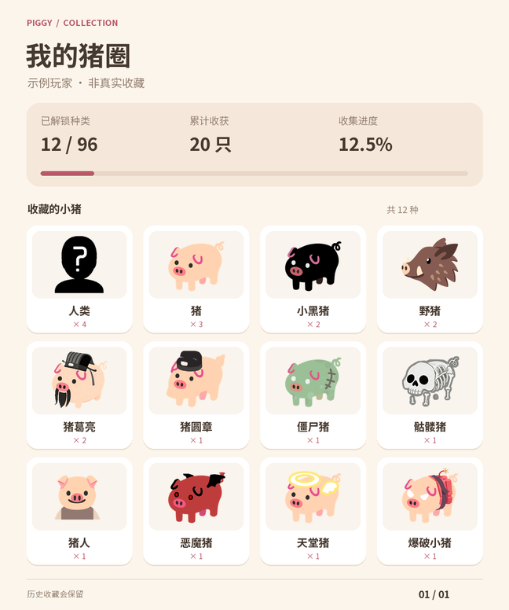

# 🐷 小猪收集册

**每天领一只小猪，把日子攒成一座猪圈。**

✨ [AstrBot](https://github.com/AstrBotDevs/AstrBot) · QQ 官方机器人 / 其他群聊平台 · 每日抽猪与跨群收藏 ✨

[功能亮点](#features) · [效果预览](#preview) · [安装使用](#usage) · [R2 配置](#r2) · [猪库维护](#catalog) · [数据备份](#backup)

---

## ✨ 能玩什么

- 每天抽一只小猪；当天重复使用会看到同一只，收藏跨群共享。
- 在图鉴里查看解锁进度，在猪圈里翻看已收藏的小猪。
- 查看种类榜和数量榜，也可以设置自己的展示称呼。

## 🍮 效果预览

<table>
  <tr>
    <th>📖 小猪图鉴</th>
    <th>🏡 我的猪圈</th>
  </tr>
  <tr>
    <td valign="top"></td>
    <td valign="top"></td>
  </tr>
</table>

## 🚀 安装与使用

在 AstrBot 插件管理中使用仓库地址 `https://github.com/yun474/astrbot_plugin_piggy` 安装。需要 AstrBot 3.5.3 或更新版本。若已启用旧版“今日小猪”插件，请先停用，避免指令冲突。

在群里 @机器人发送：

| 指令 | 用途 |
| --- | --- |
| `今日小猪` / `抽小猪` | 抽取当天的小猪 |
| `小猪图鉴 [页码]` | 查看全部小猪和解锁进度 |
| `我的猪圈 [页码]` | 查看自己的收藏 |
| `小猪排行` | 查看种类榜和数量榜 |
| `小猪称呼 名字` | 设置展示称呼，限 1–24 字 |
| `小猪重载` | 管理员应用猪库修改 |
| `小猪备份` | 管理员创建本地备份 |
| `小猪诊断` | 管理员检查图床上传与 QQ 图片发送 |

每天按东八区自然日计算抽取次数。同一 QQ 官方机器人应用（或同一个 AstrBot 平台实例）下，收藏和每日抽取结果跨群共享；不同平台之间的收藏互不相通。

每日抽猪默认开启重复保护：重复概率不超过 20%，连续两次抽到已拥有的小猪后，下次必出未收集的小猪（如有）。实际重复概率为「已拥有的启用种类数 / 启用总种类数」与配置上限的较小值，新玩家不会被提高重复概率。先决定抽新猪还是重复猪，再在对应池内等概率抽取。

保底按实际抽取次数计算，已有历史也计入；漏签不清零，同一天重复查看不累计。停用的小猪不参与抽池及概率分母。全部集齐后正常抽取重复猪，添加新猪后自动恢复保护。配置调整不会重抽当天结果。图床消息与直接发送的卡片都会在仍有新猪时显示重复保护进度。

## 🎛️ 图片发送方式与 R2 配置

插件可以直接向 QQ 发送图片，也可以通过图床发送带快捷按钮的消息。在插件配置的「消息展示」中，分别设置「今日小猪」「小猪图鉴」「我的猪圈」「小猪排行」是否使用图床。默认只有「今日小猪」开启图床；如果没有图床，请先关闭这个开关，其余功能默认可直接使用。

开启图床时，需要在插件配置中填写 R2 / S3 或 HTTP 图床信息；图片公网地址必须能由 QQ 直接访问。使用 R2 时，`endpoint` 填上传接口，`public_base_url` 填已绑定存储桶的公网域名，两者不要填反。若把图鉴、猪圈或排行也设为图床模式，建议给 R2 的 `piggy/temp/` 设置 7 天后删除的生命周期规则，避免临时卡片长期占用空间。

QQ 官方机器人以外的平台（如 aiocqhttp / NapCat 等）会忽略图床配置，所有卡片都通过 AstrBot 直接发图，没有快捷按钮；`小猪诊断` 只用于 QQ 官方机器人。

快捷按钮会按「快捷指令唤醒词」生成命令。默认留空即可在 @机器人后直接使用；如果 AstrBot 设置了 `/`、`!` 等唤醒词，请在这里填写相同内容。

## ⚙️ 配置项说明

以下是插件配置页中的选项及默认值。不使用图床时，关闭四个「使用图床」开关即可，图床相关选项无需填写。

| 消息与日常设置 | 默认值 | 说明 |
| --- | --- | --- |
| `duplicate_rate_cap`（重复概率上限） | `20` | 0–100，单位 %；0=有新猪必出新猪，100=自然重复概率。集齐后不受上限限制 |
| `duplicate_pity`（连续重复保底次数） | `2` | 0–30；连续重复达到此次数，下次必出新猪（如有）；0=关闭保底 |
| 今日小猪使用图床 | 开启 | 通过图床发送，附带快捷按钮；关闭后直接发送图片 |
| 小猪图鉴 / 我的猪圈 / 小猪排行使用图床 | 关闭 | 可分别开启；开启后通过图床发送并附带快捷按钮 |
| `command_prefix`（快捷指令唤醒词） | 留空 | 使用自定义唤醒词时，填与 AstrBot 相同的内容 |
| `backup_keep`（本地备份保留份数） | `7` | 自动和手动备份最多保留的份数 |

**图床配置：** 打开「展开图床配置」，在 `image_host.provider` 中选择图床，页面只显示对应参数。收起仅影响显示，不会停用图床。各类型独立保存，切换回来无需重填；四个消息功能共用当前选中的图床。

可选 Cloudflare R2（默认）、AWS S3、阿里云 OSS、腾讯云 COS、七牛云 Kodo、MinIO、Backblaze B2、DigitalOcean Spaces、其他 S3 兼容存储、兰空 Lsky Pro V2 和自定义 HTTP。对象存储通过 S3 兼容接口上传，请使用服务商提供的 S3 端点与凭据。

旧版配置首次加载时自动保存到「其他 S3 兼容存储」和「自定义 HTTP」分组，保留原选中的上传方式；已有新分组配置优先。旧 R2 配置会保留在「其他 S3 兼容存储」中，仍可照常使用。

**对象存储：** 参数位于 `image_host` 下的对应分组（`r2`、`aws`、`oss`、`cos`、`qiniu`、`minio`、`b2`、`spaces`、`s3`）：

| 配置项 | 默认值 | 填写内容 |
| --- | --- | --- |
| `endpoint` | 留空 | 上传接口；R2 格式为 `https://<ACCOUNT_ID>.r2.cloudflarestorage.com` |
| `bucket` | 留空 | 存储桶名称 |
| `access_key` / `secret_key` | 留空 | 存储桶的上传凭据 |
| `public_base_url` | 留空 | 可公开访问图片的域名，如 `https://img.example.com` |
| `region` | 按类型预设 | R2 为 `auto`；OSS、MinIO、通用 S3 为 `us-east-1`；其他类型填写实际区域 |
| `addressing_style` | `auto` | 自动按类型选择；OSS 固定为 `virtual`，其他类型可手动指定 |

阿里云 OSS 使用 S3 V2 签名与虚拟主机寻址，遵循其 [S3 兼容接口要求](https://www.alibabacloud.com/help/en/oss/developer-reference/compatibility-with-amazon-s3)。其他对象存储使用 S3 V4 签名。

**兰空 Lsky Pro V2：** 在 `image_host.lsky` 填写完整上传地址（例如 `https://你的图床/api/v1/upload`）和 Authorization 值（例如 `Bearer 你的Token`）。插件自动设置文件字段、响应路径与成功状态检查。

**自定义 HTTP：** 在 `image_host.http` 中按上传 API 填写：

| 配置项 | 默认值 | 填写内容 |
| --- | --- | --- |
| `upload_url` | 留空 | 完整的上传地址 |
| `upload_mode` | `multipart` | 文件上传用 `multipart`；要求 Base64 JSON 时选 `json_base64` |
| `upload_headers` / `upload_fields` | `{}` / `{}` | 图床要求的请求头和附加字段，均填写 JSON 对象 |
| `file_field` | `file` | 图片字段名 |
| `response_url_path` | `data.links.url` | 上传结果中图片直链的位置，如 `image.url` |
| `success_path` / `success_value` | 留空 / `true` | 图床返回成功标记时填写；无成功标记可留空 `success_path` |

**重试与缓存：** 打开「展开重试与缓存设置」后显示，一般保持默认即可。上传重试和请求超时也用于 QQ 直传，因此独立于图床选择保存。

| 配置项 | 默认值 | 说明 |
| --- | --- | --- |
| `upload_retry_count` / `image_retry_count` | `2` / `3` | 上传失败、QQ 图片发送失败后的额外重试次数；`0` 表示不重试 |
| `retry_base_delay` / `request_timeout` | `1` 秒 / `20` 秒 | 重试等待的基础间隔、单次网络请求的超时时间 |
| `cache_ttl_hours` | `168` 小时 | 固定猪图的图床链接缓存时间；应短于图床链接有效期 |
| `temp_cache_hours` | `12` 小时 | 临时卡片链接复用时间；不会自动删除图床图片 |

## 🧩 猪库维护

首次启动会在 `data/plugin_data/astrbot_plugin_piggy/catalog/` 生成猪库。管理员可编辑 `pigs.json` 和 `images/` 中的图片，再发送 `小猪重载` 应用修改。新增小猪时添加新条目和图片；下架时将对应条目的 `enabled` 设为 `false`。请勿把旧 `id` 分配给另一种猪，以免合并原有收藏。历史收藏不会因下架而删除。

## 💾 数据备份

插件会在启动时及之后每 24 小时自动备份；也可以发送 `小猪备份`。备份文件位于插件数据目录的 `backups/`，包含收藏数据、猪库和历史图片。恢复时先停用插件，保留原数据目录作回退，再将可信备份解压到新的空插件数据目录，最后启用插件。图床凭据保存在 AstrBot 配置中，不包含在备份里。

## 💛 致谢

初始猪库与图片来自 [MegSopern/astrbot_plugin_rollpig](https://github.com/MegSopern/astrbot_plugin_rollpig/tree/42490b1b88367260c137c1147b05a3c052f22d33)，感谢前辈们留下的一群小猪~  项目代码遵循 [MIT 许可证](LICENSE)；随包字体 [Noto Sans SC](https://github.com/google/fonts/tree/main/ofl/notosanssc) 遵循 `resources/fonts/OFL.txt` 中的 SIL Open Font License。

---

喜欢的话，给云云点一颗 ⭐ 吧！

[更新日志](CHANGELOG.md) · [反馈问题](https://github.com/yun474/astrbot_plugin_piggy/issues) · [MIT License](LICENSE)

**插件问题反馈 QQ 群：947667614**

